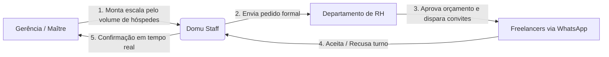

# Domu Staff — Relatório Executivo do Projeto

**Data:** Setembro de 2025  
**Documento:** Visão de Produto, Status de Desenvolvimento & Roadmap  
**Foco:** Gestão Inteligente de Escalas e Freelancers para Hotelaria e Gastronomia  

---

## 1. A Ideia & Proposta de Valor

### 1.1. O Cenário e a Dor de Mercado
Na hotelaria e na gastronomia de alto padrão, a demanda de clientes oscila intensamente conforme a ocupação do hotel, dias de semana, feriados e eventos corporativos. Para atender a essa volatilidade sem inflar a folha fixa, os estabelecimentos recorrem a equipes de freelancers (garçons, bartenders, cozinheiros, cumins, recepcionistas e governança).

Hoje, esse processo ocorre de forma caótica:
- **Grupos de WhatsApp informais:** Maîtres e gestores perdem horas enviando mensagens em grupos barulhentos onde mensagens se perdem.
- **Falta de previsibilidade e no-shows:** Freelancers confirmam de boca e faltam de última hora sem substituto prévio.
- **Conflito Operação vs. RH:** A gerência precisa de braços imediatos no salão, enquanto o RH precisa validar orçamentos, dados cadastrais e conformidade trabalhista.
- **Falta de histórico e reputação:** Dificuldade em saber quem foram os melhores profissionais escalados em turnos anteriores.

### 1.2. A Solução: Domu Staff
O **Domu Staff** é uma plataforma SaaS B2B de **Workforce Management sob demanda**, que conecta a **Gerência Operacional**, o **RH** e os **Freelancers** em um fluxo único, profissional e auditável.

---

## 2. O Ecossistema em 3 Perfis

O Domu Staff organiza a operação em **três personas essenciais**:

| Perfil | Papel no Domu Staff | Principal Objetivo |
| :--- | :--- | :--- |
| **Gerência (Maître / Chef / Governanta)** | Monta a escala conforme o movimento de hóspedes e seleciona os freelancers ideais para seu setor. | Garantir equipe qualificada e completa no salão/cozinha sem esforço manual. |
| **RH / Controladoria** | Analisa os pedidos da gerência, aprova limites orçamentários e dispara convites oficiais. | Manter conformidade trabalhista, controle de custos e redução de passivos. |
| **Freelancer (Garçom, Bar, Recepção, etc.)** | Cadastra disponibilidade de dias/horários, recebe convites compatíveis e confirma diárias. | Ter renda previsível, organização de turnos e convites sem intermediários informais. |

---

## 3. O que Já Está 100% Desenvolvido

Até o momento, a aplicação já conta com o fluxo principal desenhado e validado:

### ✅ 3.1. Autenticação & Identidade Visual
- **Interface Corporativa Premium:** Fundo escuro profissional (`#070D1F`), tipografia de alto padrão e contraste calibrado.
- **Identidade da Marca:** Aplicação da marca oficial Domu Staff (Hotel Atlântico).
- **Entrada Direta:** Fluxo de login e cadastro simplificado que conduz diretamente à personalização da conta.

### ✅ 3.2. Onboarding Guiado (4 Etapas)
1. **Etapa 1 (Tipo de Conta):** Segmentação entre *Sou freelancer*, *Sou do RH* e *Sou Gerencia*.
2. **Etapa 2 (Seus Dados):** Cadastro enxuto e direto (Nome, Cargo/Estabelecimento, WhatsApp), sem burocracias irrelevantes.
3. **Etapa 3 (Disponibilidade e Regras):**
   - **Para Freelancers:** Seleção interativa de dias da semana (`Seg` a `Dom`, com atalhos *Todos* e *Finais de Semana*) e turnos padronizados de hotelaria (**07h–15h**, **09h–17h**, **15h–23h** e Noturno **23h–07h**), com ativação de convites via WhatsApp.
   - **Para Gerência e RH:** Definição de alertas de substituição emergencial e canal de convocação.
4. **Etapa 4 (Conclusão):** Resumo completo dos parâmetros configurados antes de acessar o painel.

### ✅ 3.3. Painel da Gerência — "Montar Escala"
- **Barra Superior & Setores:** Pílulas de filtro para **Restaurante**, **Recepção**, **Bar**, **Cozinha**, **Governança** e **CDC**.
- **Carrossel Semanal (7 Dias):** Cálculo de necessidade de profissionais baseado na ocupação de hóspedes (ex: 500 hóspedes = meta de 14 pessoas).
- **Workspace em Duas Colunas:**
  - *Esquerda:* Lista de **Freelancers Disponíveis** com busca em tempo real, status verde de prontidão, seleção individual ou em lote e atalho de contato.
  - *Direita:* **Selecionados para o Dia** com exclusão instantânea (`✕`), resumo de ocupação vs. contratados e botão de envio direto ao RH.
- **Navegação Própria:**
  - Telas de apoio exclusivas para a Gerência: **Meus Pedidos ao RH** (com status em tempo real) e **Turno de Hoje** (check-in de presença com KPIs ao vivo).
  - Fluxo de retorno seguro: a seta de voltar (`←`) e o menu lateral mantêm o gestor 100% no ambiente da gerência, sem saltar para o RH.

### ✅ 3.4. Painel do RH — "Escalas da Semana"
- **Visão Kanban por Status:** *Solicitadas*, *Em análise*, *Enviadas*, *Confirmadas* e *Pendências*.
- **Tela de Detalhe e Aprovação:** Painel de conferência dos nomes indicados pelo Maître, justificativa operacional e botão de disparo oficial da convocação.

### ✅ 3.5. Painel do Freelancer — "App do Profissional" *(novo)*
- **Convites Recebidos:** Cards com hotel, setor, data, horário, local, valor da diária e ações **Aceitar vaga** / **Recusar**.
- **Minha Agenda:** Lista dos turnos confirmados após aceite.
- **Histórico Financeiro:** Extrato de diárias (pago / a receber) com totais do mês.
- **Minha Disponibilidade:** Liga/desliga dias, turnos e WhatsApp — alimenta a lista do maître.
- **Navegação por perfil:** Sidebar e identidade mudam automaticamente entre Gerência, RH e Freelancer (seletor de demo no menu).

---

## 4. O que Falta Fazer (Roadmap para Conclusão)

Para transformar o Domu Staff em uma solução completa de ponta a ponta pronta para uso em produção, mapeamos os seguintes módulos:

### 📌 Módulo B: Motor de Mensageria WhatsApp (Convocação Oficial)
Demonstração e automação do canal de comunicação mais usado no setor:
- **Template de Convocação:** Mensagem automática enviada ao freelancer com texto padronizado contendo dados do turno e botões interativos de resposta ("Confirmar Presença" / "Não poderei ir").
- **Gatilho de Substituição Automática:** Caso um freelancer recuse ou não responda em X horas, o sistema sugere o próximo da lista de espera com o mesmo perfil.

### 📌 Módulo C: Ponto Digital & Check-in Presencial (aprofundamento)
A tela de **Turno de Hoje** já existe no painel da gerência. Falta:
- **Leitor de QR Code** no dia do evento.
- **Alerta de Atraso / Falta Crítica** automático se faltarem 30 minutos e o profissional não registrar presença.

### 📌 Módulo D: Avaliação Pós-Turno & Ranking de Talentos
- **Feedback ao Final do Evento:** O gestor atribui nota (1 a 5 estrelas) em quesitos como *Pontualidade*, *Apresentação Pessoal/Uniforme* e *Agilidade no Atendimento*.
- **Lista de Favoritos ("Estrelas da Casa"):** Na próxima vez que o Maître for montar a escala, os freelancers com melhores notas aparecem no topo da lista com selo de destaque.

### 📌 Módulo E: Fechamento Financeiro & Relatórios para a Diretoria
- **Consolidação Semanal por Setor:** Relatório gráfico para o RH e Diretoria Financeira indicando:
  - Custo total com freelancers na semana (Restaurante vs. Bar vs. Recepção vs. Cozinha).
  - Custo médio por hóspede atendido.
  - Taxa de conversão de convites e índice de faltas.

---

## 5. Sugestão de Próximo Passo

Com o ciclo Gerência → RH → Freelancer já navegável na UI, o próximo salto de valor é o **Motor de WhatsApp (Módulo B)**: disparar a convocação oficial a partir da aprovação do RH e refletir Aceitar/Recusar no painel do profissional em tempo real.
