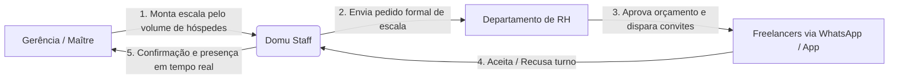

# Domu Staff — Relatório Executivo do Projeto

**Data:** Atualizado em Setembro de 2026  
**Documento:** Visão de Produto, Arquitetura de Segurança, Status de Desenvolvimento & Roadmap  
**Foco:** Gestão Inteligente de Escalas e Freelancers para Hotelaria e Gastronomia  

---

## 1. A Ideia & Proposta de Valor

### 1.1. O Cenário e a Dor de Mercado
Na hotelaria e na gastronomia de alto padrão, a demanda de clientes oscila intensamente conforme a ocupação do hotel, dias de semana, feriados e eventos corporativos. Para atender a essa volatilidade sem inflar a folha fixa, os estabelecimentos recorrem a equipes de freelancers (garçons, bartenders, cozinheiros, cumins, recepcionistas e governança).

Hoje, esse processo ocorre de forma caótica:
- **Grupos de WhatsApp informais:** Maîtres e gestores perdem horas enviando mensagens em grupos barulhentos onde dados se perdem.
- **Falta de previsibilidade e no-shows:** Freelancers confirmam de boca e faltam de última hora sem substituto prévio.
- **Conflito Operação vs. RH:** A gerência precisa de braços imediatos no salão, enquanto o RH precisa validar orçamentos, dados cadastrais e conformidade trabalhista.
- **Risco de Acessos Indevidos:** Sistemas tradicionais que permitem qualquer usuário escolher ser "Gerente" expõem dados estratégicos e orçamentos da empresa.

### 1.2. A Solução: Domu Staff
O **Domu Staff** é uma plataforma SaaS B2B de **Workforce Management sob demanda**, que conecta a **Gerência Operacional**, o **RH** e os **Freelancers** em um fluxo único, profissional, seguro e auditável.

---

## 2. O Ecossistema e Segregação de Perfis Blindada

O Domu Staff organiza a operação em **três personas essenciais**, com arquitetura de permissões estrita para evitar cadastros indevidos:

| Perfil | Nível de Acesso | Forma de Cadastro / Ingressão | Principal Objetivo |
| :--- | :--- | :--- | :--- |
| **Freelancer (Garçom, Bar, Recepção, etc.)** | Acesso operacional restrito aos seus próprios convites, diárias e agenda. | **Público:** Cadastro direto na tela "Criar conta". | Visualizar escalas, confirmar diárias e manter renda previsível. |
| **RH / Controladoria (Master)** | Acesso administrativo completo: controle de custos, aprovação de escalas e emissão de convites. | **Onboarding / Convite:** Cadastro vinculado ao Estabelecimento / Empresa matriz. | Manter conformidade trabalhista, controle orçamentário e emissão de convites. |
| **Gerência Operacional (Maître / Chef / Governança)** | Acesso setorial: montagem de escalas e seleção de freelancers para o seu setor. | **100% Blindado por Link:** Somente ingressa via Link de Convite exclusivo emitido pelo RH. | Montar escalas do setor conforme taxa de ocupação sem burocracia manual. |

---

## 3. O que Já Está 100% Desenvolvido e Implementado

### ✅ 3.1. Autenticação Moderna & Validação Rigorosa
- **Design Split-Screen Premium:** Showcase institucional à esquerda com widget ao vivo de escalas e portal de autenticação moderno à direita.
- **Alternância Instantânea (Entrar / Criar Conta):** Abas fluidas com animação e persistência de estado.
- **Critérios Rigorosos de Cadastro:**
  - **Nome Completo:** Validação estrita de Nome e Sobrenome (mínimo de 2 partes, sem números ou caracteres especiais).
  - **E-mail Corporativo/Pessoal:** Regex rigoroso padrão RFC 5322.
  - **WhatsApp com Máscara em Tempo Real:** Formatação automática `(DD) 99999-9999` com validação de DDD real brasileiro (11 a 99).
  - **Senha Forte de 8+ Dígitos:** Checklist visual dinâmico com 4 requisitos (8 caracteres, maiúscula, minúscula, número) e medidor de força (Fraca / Média / Forte).
  - **Campo de Confirmação de Senha:** Validação em tempo real com indicador visual (`✓ Senhas coincidem` / `✕ As senhas não coincidem`) e botão de alternância de visibilidade (`Eye` / `EyeOff`).
- **Lembrar Conexão Opcional:** Checkbox desmarcado por padrão e campos vazios na inicialização para máxima segurança.
- **Mensagens Humanizadas:** Sem jargões técnicos em caso de erro de credenciais.

### ✅ 3.2. Integração com Banco de Dados Supabase & PostgreSQL
- **Supabase Auth + Database Real:**
  - Criptografia de senhas padrão da indústria via Supabase Auth.
  - Tabela `profiles` com relacionamento cascade à `auth.users`.
  - **Gatilho Automático (`handle_new_user`):** Toda vez que um usuário se cadastra, o banco cria e preenche automaticamente o perfil com nome, telefone e função.
  - **Row Level Security (RLS):** Políticas de acesso liberadas para cadastro fluido e segregação de visibilidade.
  - **Script de Inicialização Mestre (`supabase/setup_complete.sql`):** Criação das 9 tabelas do ecossistema, triggers, políticas e seed completo do *Hotel Atlântico Copacabana*.

### ✅ 3.3. Onboarding Guiado (Sem Opção Pública de Gerência)
1. **Etapa 1 (Perfil):** Escolha limpa entre *Sou freelancer* e *Sou do RH / Gestão*. A opção de se autopromover a Gerente foi eliminada.
2. **Etapa 2 (Dados Operacionais):** Coleta de dados com autopreenchimento a partir do cadastro inicial (sem duplicidade de perguntas).
3. **Etapa 3 (Disponibilidade & Turnos):**
   - **Para Freelancers:** Seleção de dias (`Sex`, `Sáb`, `Dom`) e turnos de hotelaria (`15h – 23h`, `07h – 15h`, `23h – 07h`).
   - **Para RH:** Definição de regras de diárias e notificações emergenciais.
4. **Etapa 4 (Conclusão):** Resumo visual dos parâmetros e ativação da conta.

### ✅ 3.4. Painel da Gerência — "Montar Escala"
- **Seleção por Setor:** Restaurante, Recepção, Bar, Cozinha, Governança e CDC.
- **Carrossel Semanal:** Metas dinâmicas de profissionais baseadas no volume de hóspedes.
- **Workspace Interativo:** Lista de freelancers disponíveis à esquerda, equipe escalada à direita e envio formal ao RH em 1 clique.
- **Navegação Própria:** Telas de apoio exclusivas (*Meus Pedidos ao RH* e *Turno de Hoje*).

### ✅ 3.5. Painel do RH — "Gestão de Escalas & Convites"
- **Kanban Estratégico:** *Solicitadas*, *Em análise*, *Enviadas*, *Confirmadas* e *Pendências*.
- **Aprovação e Devolução:** Possibilidade de aprovar ou devolver solicitações ao Maître com justificativa.
- **Emissão de Convites para Gerência:** Geração de links seguros com tokens para admissão de novos gestores operacionais.

### ✅ 3.6. Painel do Freelancer — "Minha Área"
- **Gestão de Convites:** Aceitar ou recusar convites de turnos.
- **Minha Agenda:** Turnos confirmados com horário, setor e remuneração da diária.
- **Minha Disponibilidade:** Atualização contínua de dias livres e horários.

---

## 4. Novas Ideias & Próximas Implementações no Roadmap

### 📌 Ideia 1: Convocação Automatizada via WhatsApp Oficial (Meta Cloud API)
- Envio de mensagem com botões interativos direto no WhatsApp do freelancer:
  - `[ ✅ Confirmar Presença ]`
  - `[ ❌ Não poderei ir ]`
- Confirmação automática sincronizada no painel do RH e do Maître sem intervenção humana.

### 📌 Ideia 2: Fila Inteligente de Substituição ("Auto-Fill")
- Se um freelancer recusar um turno ou não responder em até 2 horas, o sistema convoca automaticamente o próximo profissional disponível com a mesma nota de qualificação.

### 📌 Ideia 3: Ponto Digital por Geofencing / QR Code Dinâmico
- O freelancer faz o check-in pelo celular ao chegar no hotel (validado por localização GPS de até 50 metros do estabelecimento) ou via leitura de QR Code no balcão do Maître.

### 📌 Ideia 4: Reputação & "Estrelas da Casa" (Ranking Pós-Turno)
- Avaliação de 1 a 5 estrelas após cada turno pelo gestor:
  - Pontualidade
  - Postura & Apresentação
  - Produtividade
- Profissionais com média 5 estrelas ganham prioridade automática nas escalas de maior valor (eventos de gala e finais de semana).

### 📌 Ideia 5: Repasse Financeiro Automatizado (PIX Split)
- Integração de pagamento para liquidação das diárias confirmadas via PIX diretamente para a chave cadastrada pelo freelancer ao término do evento.

---

## 5. Resumo da Situação Atual
O Domu Staff encontra-se em estágio avançado de prototipagem funcional, com design de padrão internacional, banco de dados relacional estruturado no Supabase e regras de negócio e validação altamente consistentes.
